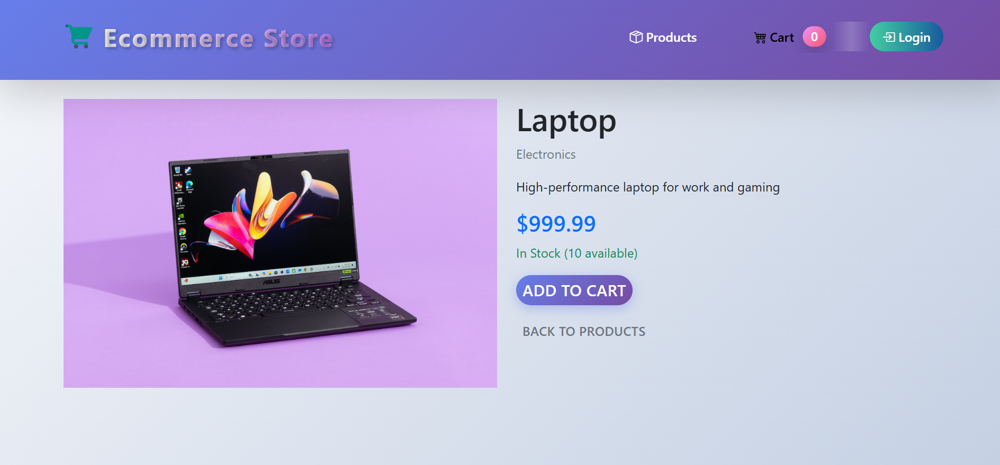

# Ecommerce Store (Django + Khalti Integration)

A modern, full-featured ecommerce web application built with Django. This project supports user authentication, product management, shopping cart, order management, and Khalti payment gateway integration for online payments (test mode).

## Features

- User registration, login, and logout
- Product listing, detail, and search
- Shopping cart with AJAX add/remove/update
- Checkout with address and contact details
- Order management and order history
- Khalti payment gateway integration (test mode)
- Admin dashboard for product management
- Responsive, modern UI with Bootstrap 5

## Tech Stack

- Python 3.10+
- Django 4.2+
- Bootstrap 5 & Bootstrap Icons
- SQLite (currently used by me) or  PostgreSQL (optional - best SQL Database for this project)
- Khalti Payment Gateway (test mode)

## Getting Started

### 1. Clone the Repository

```bash
# Clone the project
https://github.com/yourusername/ecommerce_project.git
cd ecommerce_project
```

### 2. Create and Activate a Virtual Environment

```bash
python -m venv venv
venv\Scripts\activate  # On Windows
# or
source venv/bin/activate  # On Mac/Linux
```

### 3. Install Dependencies

```bash
pip install -r requirements.txt
```

### 4. Apply Migrations

```bash
python manage.py makemigrations
python manage.py migrate
```

### 5. Create a Superuser (Admin)

```bash
python manage.py createsuperuser
```

### 6. Run the Development Server

```bash
python manage.py runserver
```

Visit [http://127.0.0.1:8000/store/](http://127.0.0.1:8000/store/) in your browser.

## Khalti Payment Integration (Test Mode)

- The project uses Khalti's test public and secret keys for development.
- You can use the test payment button or Khalti widget for payment simulation.
- For production, replace the test keys with your live Khalti keys in `views.py`.

## Project Structure

```
├── ecommerce_project/           # Django project settings
├── store/                      # Main app (models, views, forms, admin, etc.)
├── templates/
│   ├── base.html               # Main base template
│   └── store/                  # Store app templates
├── static/
│   ├── css/style.css           # Custom styles
│   └── js/cart.js              # Cart and UI scripts
├── media/                      # Uploaded product images
├── requirements.txt            # Python dependencies
├── manage.py                   # Django management script
```

## Environment Variables

- By default, settings are in `settings.py`.
- For production, configure your own `SECRET_KEY`, database, and Khalti keys.

## Admin Panel

- Visit `/store/admin/` to manage products, categories, orders, and users.

## Screenshots

### Customer View




### Admin View


## License

This project is for educational/demo purposes only.

---

**Developed with Django, Bootstrap, and ❤️ by [Sijal Neupane]**
